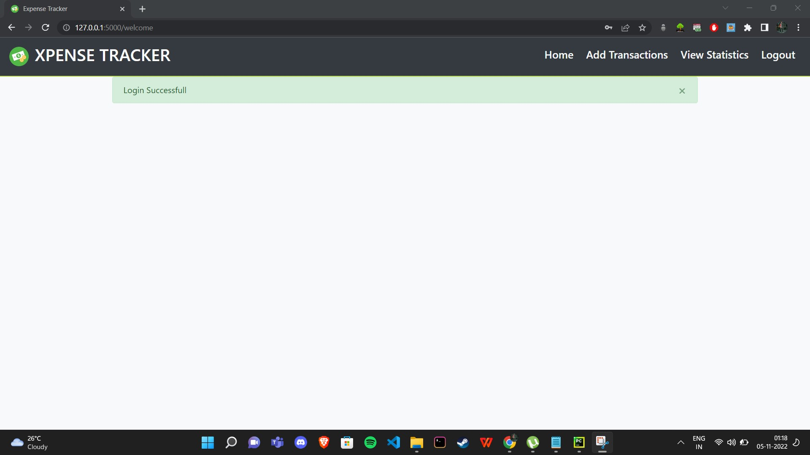

# Personal Expense Tracker Application

Implemented :

1. Registration Page -> Implemented and connected with DB2 database

2. Login Page -> Implemented and connected with DB2 database

3. Onboarding questionnare to fill basic savings details of users

4. Empty dasboard

